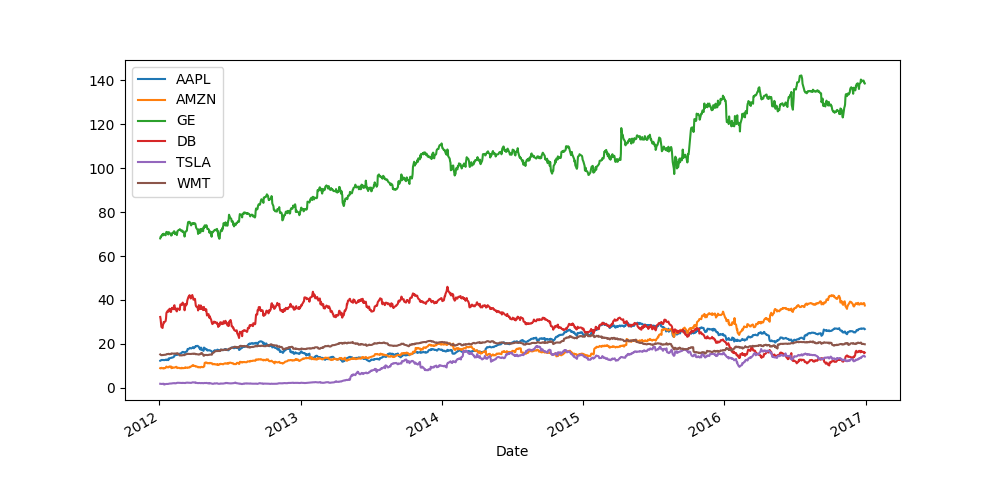
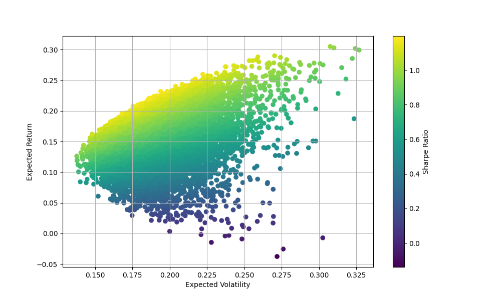
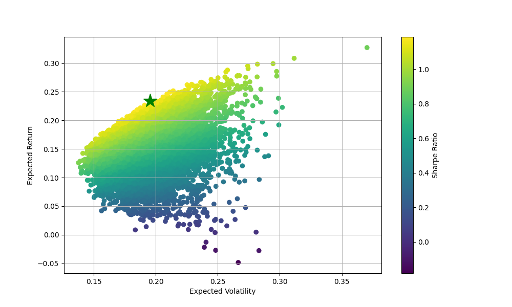

# quantitative-finance-and-algo-trading
Python repository to build scripts relevant for Quantitative Finance and useful for Algorithmic Trading.

# Markowitz Model
Deals with generating 10000 random portoflios for stocks = ['AAPL', 'AMZN', 'GE', 'DB', 'TSLA', 'WMT'].

Stock historical data has been pulled from yahoo finance.

Calculates their expected return and expected volatility to find the optimal portfolio on the efficient frontier.

The final result of optimal portfolio analysis using Markowitz Model

# CAPM 
In the implementation for CAPM we have taken monthly returns into considerations. 
Daily returns would help in microscopic analysis and takes holiday/non calc days into account.
However daily returns are not necessarily normally distributed while monthly returns are more approximate to normal distribution.
Since the Regression model assumes Normal Distribution in its implementation, Monthly returns are favourable for more accurate predictions.